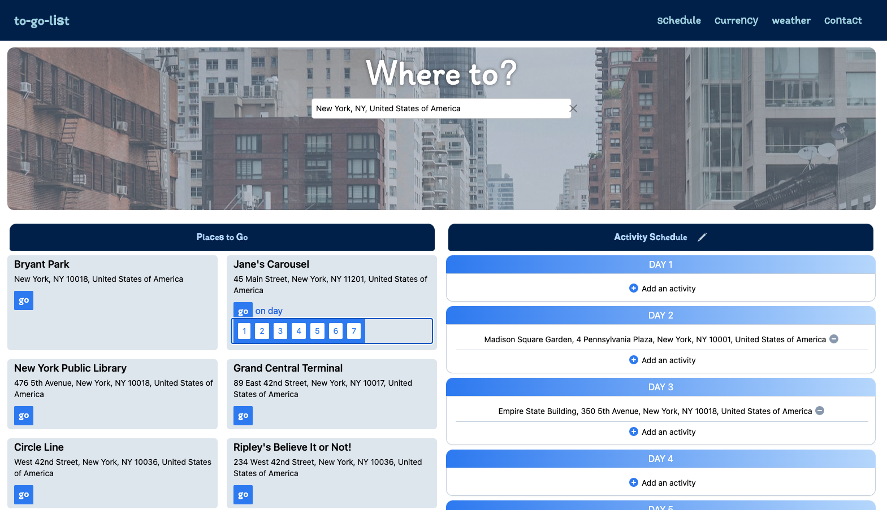
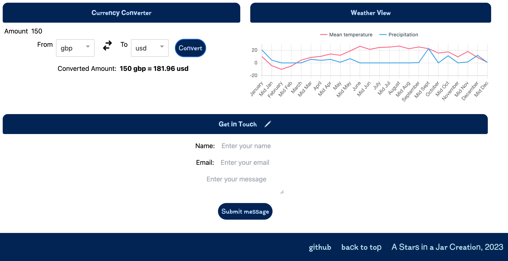

# To-Go-List

## Description

The To-Go-List is a travel dashboard which allows to create a travel itinery for a given destination, access travel recommendations which can be dynamically added to the itinary, information about the weather across the year and current exchange rates. It is mobile-friendly and saves the itinary in local storage. Users can send questions to the developer via a contact form at the bottom of the page. 

## Installation

After opening, run the following in the terminal
~~~ js
npm i
~~~

## Packages, Libraries and Technologies

### Node Libraries
- geocoder-autocomplete - for searching destinations with autocomplete
- react heroicons - for add/remove buttons and currency converion arrows
- react headlessuiheadlessui - for dropdown that was adapted for ‘Go on day’
- chart.js for weather chart
- react-chartjs-2 for chart.js react integration
- pexels for image api
- uniqid for managing itinerary items

### API's
- Geoappify api for attraction data
- OpenMeteo api for annual weather data
- Currency api

### Packages
- Tailwind CSS

## Links
- [Netlify](https://main--gentle-faun-f6742b.netlify.app)
- [Github Repo](https://github.com/Sam010000101/to-go-list)

### Sample Images

